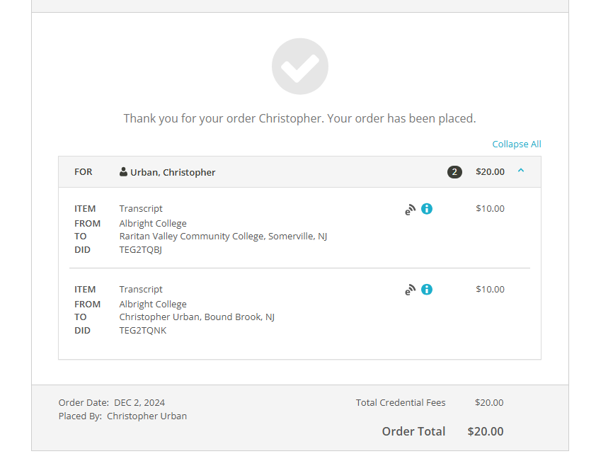
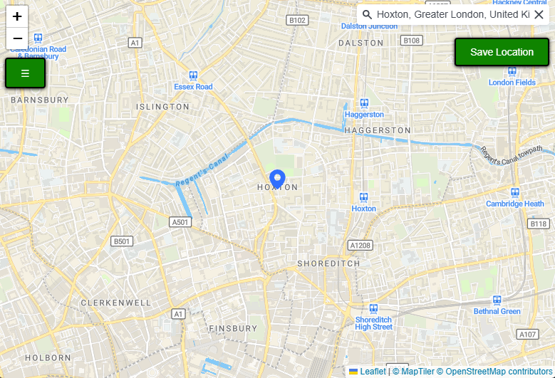
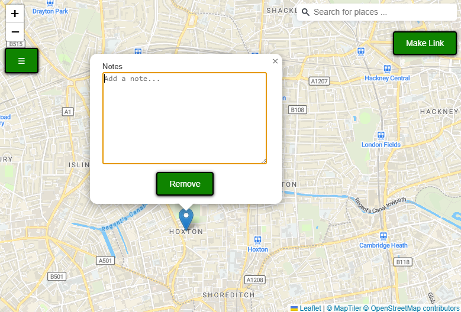
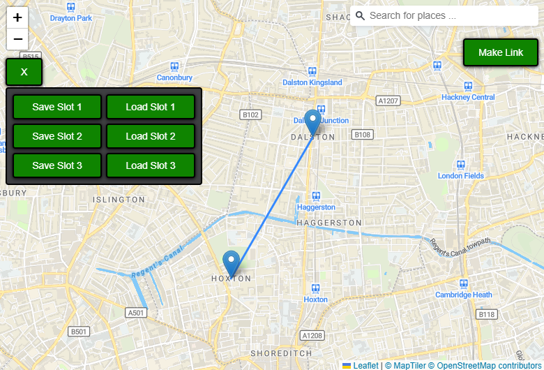

# VacationMapper

VacationMapper is a desktop Electron app for planning trips on an interactive map.
You can search for places, drop markers for stops you care about, write notes for each stop, and draw links between markers to sketch travel routes.

## What the app does

- Search locations using a geocoding search bar.
- Add map markers from the currently selected searched location.
- Add notes to each marker in a popup.
- Remove markers.
- Link two markers with a line to represent a route/connection.
- Save and load map state using 3 local save slots.

## Tech stack

- Electron (desktop shell)
- Electron Forge (run/package/make/publish workflow)
- Leaflet (map rendering and marker/line interactions)
- MapTiler (map tiles + geocoding)

## Prerequisites

- Node.js 18+ (recommended)
- npm

## Install

```bash
npm install
```

## Run locally

```bash
npm start
```

This launches the Electron window and loads the map UI.

## How to use

1. Search for a place in the search bar at the top-right.
<p align="center">
   
</p>

2. After the map moves to the result, click **Save Location**.
<p align="center">
   
</p>

3. Click a marker to open its popup:
   - Enter notes in the text area.
   - Click **Remove** to delete the marker.
   <p align="center">
      
   </p>

4. To connect markers:
   - Click a marker.
   - Click **Make Link**.
   - Click a second marker to create a line.
   <p align="center">
      
   </p>

5. Use the top-left menu button (**☰**) for save/load:
   - Save Slot 1/2/3
   - Load Slot 1/2/3

## Data persistence

- Marker and line data is saved in browser local storage inside the Electron app.
- Save slots are independent (`slot 1`, `slot 2`, `slot 3`).
- Clearing app storage clears saved map data.

## Project layout

- `map.js`: Electron main process entry point (creates the window).
- `index.html`: Main UI and map interaction logic.
- `style.css`: App styles.
- `forge.config.js`: Packaging/maker/publisher configuration.
- `package.json`: Scripts, dependencies, metadata.

## License

MIT
